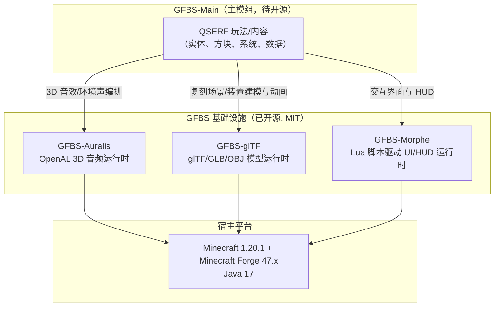
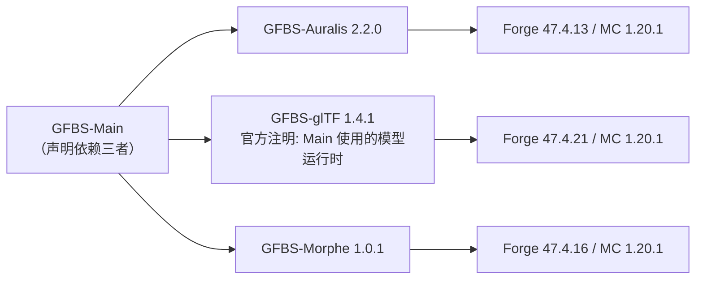

# GFBS-Main Code Wiki

> 本文档依据仓库当前可核实的信息编写。
> **状态说明（重要）**：截至 2026-08-30，[GFBS-Main](https://github.com/LytharaLab/GFBS-Main) 仓库仅包含 `README.md`，不含任何源代码（git 历史仅一次提交）。项目处于 Alpha 开发期，官方计划在 CCNR-QAEC 服务器正式开放后全面开源。因此本文档中与"代码内部实现"相关的章节（关键类、运行方式等）目前基于已公开的**三个依赖项目**的官方文档构建，并在涉及 GFBS-Main 本体实现的位置明确标注为"待开源后补充"。如需在未来代码发布后同步本 Wiki，请更新各 "待补充" 区块。

---

## 1. 项目概览

| 项目 | 内容 |
| --- | --- |
| 仓库 | [LytharaLab/GFBS-Main](https://github.com/LytharaLab/GFBS-Main) |
| 官方定位 | *A Minecraft mod project dedicated to recreating QSERF (Roblox)* —— 在 Minecraft 中复刻 Roblox 游戏 QSERF 的模组项目 |
| 技术栈 | Java 17 + Minecraft Forge（目标版本 1.20.1，依据依赖项目一致的技术基线推导） |
| 开发状态 | Alpha 开发中；待 CCNR-QAEC 服务器正式开放后全面开源 |
| 维护团队 | [GFBS Mod Series Maintainers](https://github.com/orgs/LytharaLab/teams/gfbs-mod-series-maintainers) |
| 当前代码规模 | 仅 `README.md`（772 字节），无构建脚本、无源码、无 License 声明 |
| 默认分支 | `main`（唯一分支，唯一提交 `5e468d3`） |

GFBS（GFSB Mod Series）是 LytharaLab 组织旗下一组相互配合的 Minecraft Forge 1.20.1 模组系列。GFBS-Main 是系列主模组，负责承载 QSERF 复刻玩法内容，并复用系列中的三个基础设施库（音频 / 模型 / UI）。

---

## 2. 仓库结构（当前）

```text
GFBS-Main/
└── README.md        # 项目说明、依赖声明、维护团队信息（唯二内容即：简介 + 依赖列表）
```

> 待开源后预期结构（依据 Forge 1.20.1 模组与系列内项目惯例推导，非当前事实）：

```text
GFBS-Main/
├── build.gradle / settings.gradle / gradle.properties
├── src/main/java/org/lytharalab/gfbs/main/   # 主模组逻辑
├── src/main/resources/                        # 模组元数据 (mods.toml)、资源
└── src/test/java/                             # 测试
```

---

## 3. 整体架构

GFBS 系列采用**分层基础设施 + 主内容模组**的架构：GFBS-Main 不重复造轮子，而是依赖三个独立开源运行时承载通用能力，自身专注玩法内容实现。



角色分工（职责描述源自各依赖项目官方 README）：
- **Auralis**：旁路原版声音引擎的独立 OpenAL 播放层，提供持久化声音实例、世界空间定位、流式播放、衰减曲线、音频总线/EFX 效果与服务器端到客户端的编排能力。
- **glTF**：模型运行时，负责 glTF 2.0 / GLB / OBJ 的加载、渲染、骨骼与形态动画、材质变体、同步、碰撞等，官方明确说明其"被 GFBS: Main 使用"。
- **Morphe**：Lua 脚本驱动的 UI/HUD 运行时，支持全屏、透明屏、被动 HUD、可交互叠加 HUD，Java 侧负责注册、渲染集成、网络与服务器权威行为。

---

## 4. 模块职责

### 4.1 GFBS-Main —— 主模组（代码待开源）
- 职责：实现 QSERF 复刻核心玩法与内容（具体模块清单待代码发布后补充）。
- 已知事实：官方 README 声明其依赖 Auralis / glTF / Morphe 三个项目；glTF 官方文档声明"它是 GFBS: Main 使用的模型运行时"。
- **待补充**：包结构、核心实体/方块/系统清单均未公开。

### 4.2 GFBS-Auralis —— 音频运行时（独立仓库，v2.2.0）
- 定位：实例化空间音频运行时，运行独立的 OpenAL 播放层，与 Minecraft 原版声音引擎并行存在。
- 核心能力：
  - 持久化逻辑声音实例：play / pause / stop / loop / volume / pitch / speed / priority；
  - **逻辑声音虚拟化**：播放实例与稀缺的物理 OpenAL Source 分离，支持 1000+ 活动实例，虚拟声音接近听者时按逻辑播放游标恢复；
  - 静态（听者相对）与流式（OGG Vorbis）播放、异步创建与解码缓存；
  - 音频总线图（Godot 风格层级总线：Master / 子总线，支持 volume / mute / solo / bypass / 运行时重路由）；
  - OpenAL EFX 效果层（13 种标准效果 + 3 种滤波器）与自定义 PCM 效果链；
  - 插件系统（效果工厂、逐实例处理器、事件监听、生命周期与依赖管理）；
  - 服务器 → 客户端编排：命令（`/gfbs_auralis`）与 `AuralisServerApi`、Tween 过渡、实体/方块绑定。
- Java 包结构（源引自 README）：`api / command / core / event / network / server / tween / utils`。
- 兼容性：Mod ID `gfbs_auralis`，MC 1.20.1，Forge 47.4.13，Java 17。

### 4.3 GFBS-glTF —— 模型运行时（独立仓库，v1.4.1）
- 定位：面向生产的 glTF / GLB / OBJ 运行时，是 GFBS: Main 的模型运行时，也被设计为可被其他模组独立集成。
- 核心能力：
  - 通过 Minecraft 资源系统异步加载模型，带请求去重、缓存、失效与资源包重载支持；
  - 不可变运行时资产 + 每个实例独立的可变节点图（索引/名称/路径查询、可见性、TRS/矩阵/后变换覆盖、morph 权重、阴影、碰撞）；
  - 完整 glTF 2.0 材质体系（metallic-roughness、emissive 独立全亮通道、PBR / UNLIT / NEON 光照模式切换）；
  - 动画播放、过渡、分层、遮罩、混合、淡入淡出、用户事件；服务器权威动画同步（RTT 时钟探测、实际 TPS 估计、分数 tick 预测）；
  - 每实例/节点/部件 RenderType 选择，锥体剔除，可选遮挡查询与碰撞（含体素碰撞）；
  - Forge 静态方块/物品模型加载器 `gfbs_gltf:gltf`；Oculus/Iris 阴影通道支持（且非必需）。
- Java 包结构：`api / core / client / network / collision`。
- 兼容性：Public API 1.4，MC 1.20.1，Forge 47.4.21，Java 17，glTF 2.0。
- 致谢：借鉴了 Bilibili 创作者 洛谔谔（前 `_二千`）的 ModelLoader 模组代码。

### 4.4 GFBS-Morphe —— UI/HUD 运行时（独立仓库，v1.0.1）
- 定位：安全、可扩展、脚本驱动的 UI 运行时；资源包/模组用 Lua 定义界面，Java 侧负责注册、渲染集成、网络与服务器权威动作。
- 核心能力：
  - Lua 定义 UI 树（像素/百分比/自动尺寸；absolute/row/column/grid 布局；滚动、flex、间距、对齐）；
  - 内置部件：`panel / text / button / image / video / item / checkbox / slider / progress / input / scroll`；
  - 全屏、透明屏、被动 HUD、可交互叠加 HUD（无需为每个界面写 `Screen` 类）；
  - 响应式状态、主题、绑定、可复用 Lua 组件、定时器、帧回调、关键帧动画，独立于 20 TPS 游戏刻驱动；
  - 服务器开启的界面/HUD 会话：文档校验、会话 ID、载荷上限、动作限流；
  - 扩展 API（`MorpheAPI`）：自定义部件、效果、脚本模块、动态变量、函数；
  - 安全模型：不接受客户端上传 Lua 源，不通过网络发送脚本文本，沙箱不暴露 `package/io/os/debug` 与 Java 反射。
- 兼容性：Script API 1，MC 1.20.1，Forge 47.4.16，Java 17，LuaJ 3.0.1。
- 命令：客户端 `/morpheui ...`，服务端管理员 `/morphe open|close ...`。

---

## 5. 依赖关系

### 5.1 GFBS-Main 的外部依赖（README 声明）

| 依赖 | 仓库 | 用途 | 版本 | Mod ID | 获取 |
| --- | --- | --- | --- | --- | --- |
| GFBS-Auralis | [LytharaLab/GFBS-Auralis](https://github.com/LytharaLab/GFBS-Auralis) | 3D 音频引擎 | 2.2.0 | `gfbs_auralis` | GitHub Releases 或源码构建 |
| GFBS-glTF | [LytharaLab/GFBS-glTF](https://github.com/LytharaLab/GFBS-glTF) | 模型运行时 | 1.4.1 | `gfbs_gltf` | GitHub Releases 或源码构建 |
| GFBS-Morphe | [LytharaLab/GFBS-Morphe](https://github.com/LytharaLab/GFBS-Morphe) | UI/HUD 运行时 | 1.0.1 | 未在 README 明示 | GitHub Releases 或源码构建 |

> 三者均为 MIT License（Copyright © 2026 LytharaLab），由同一团队维护。
> 作为库使用时，引用方模组应声明依赖（`gfbs_auralis` / `gfbs_gltf`），并将自有资源放在自己的 asset 命名空间下。

### 5.2 依赖链关系



- 依赖方向为 **GFBS-Main → 三个运行时**，三个运行时之间相互独立，均直接构建于 Forge 1.20.1 之上。
- 运行时对渲染可选依赖：glTF 不需要 Embeddium / Oculus / Iris，存在时于运行时检测。

---

## 6. 关键技术点

| 领域 | 要点 | 来源 |
| --- | --- | --- |
| 音频 | 逻辑声音虚拟化（逻辑实例 ↔ 物理 Source 分离）；音频总线图 + EFX；服务器权威编排；插件生命周期 | GFBS-Auralis 2.1.x/2.2.0 |
| 模型 | 不可变资产 + 可变异构图；resident-GPU 渲染快路径；服务器权威动画同步（RTT/TPS 估算 + 分数 tick 预测）；材质变体（PBR/UNLIT/NEON） | GFBS-glTF 1.2~1.4 |
| UI | Lua 沙箱脚本化界面；服务器权威会话（文档校验、限流）；`UiCanvas` 后端中立 API | GFBS-Morphe 1.0.1 |
| 通用 | 统一命名空间：`org.lytharalab.gfbs.<module>` 包根；Java 17 / Forge 1.20.1 基线 | 依赖项目源码结构 |

---

## 7. 关键类与函数说明

### 7.1 GFBS-Main 本体
> **待开源后补充**。当前仓库无源码，无法提供类清单、主入口类（如主 Mod 类、事件处理、玩法系统）与核心函数说明。建议在开源后按以下模板补齐。

| 类 / 函数 | 所属模块 | 说明 |
| --- | --- | --- |
| （待补充） | Main | 主模组入口（`@Mod` 注解类） |
| （待补充） | ... | ... |

### 7.2 依赖项目中已公开的 API 入口（可供集成方使用）

| API | 项目 | 说明 |
| --- | --- | --- |
| `org.lytharalab.gfbs.auralis.api.AuralisApi` | Auralis | 创建/控制声音实例、总线系统入口（`create` / `createStreamed` / `createAsync` / `buses()`） |
| `org.lytharalab.gfbs.auralis.api.AuralisSoundInstance` | Auralis | 逻辑声音实例：`play / pause / stop / bind / unbind`、`setStatic / setPosition / setVolume / setLooping / setPriority / setMinDistance / setMaxDistance`、状态查询 `isVirtual / isBound / isPlaying / getPlaybackPositionSeconds` |
| `org.lytharalab.gfbs.auralis.api.effect.AuralisEffects` / `EfxParameter` | Auralis | EFX 效果与参数（如 `reverb()` + `REVERB_DECAY_TIME`） |
| `org.lytharalab.gfbs.auralis.api.AuralisServerApi` | Auralis | 服务端控制 |
| `org.lytharalab.gfbs.gltf.api.ClientGltfApi` | glTF | 客户端模型管理入口：`models().load(...)` 异步加载资产 |
| `GltfInstance` / `GltfNodeManager` / `GltfRenderer` / `GltfMaterialVariant` | glTF | 实例节点图、渲染、材质变体（`instance.nodes().requirePath(...)`、`GltfRenderer.render(...)`、`defineVariant(...)`） |
| `SyncedGltfAnimations` | glTF | 服务器权威动画同步绑定入口（`bind(...)`） |
| `org.lytharalab.gfbs.morphe.api.MorpheAPI` | Morphe | 扩展注册入口（`registerWidget` / `registerScriptModule`） |
| `MorpheClient` / `MorpheServer` | Morphe | 客户端打开界面/HUD（`open` / `showHud`）+ 服务端权威界面（`open` / `registerActionHandler`） |
| `MorpheViewOptions` / `MorpheUiActionEvent` | Morphe | HUD 交互选项 / Forge 事件总线上发布的动作事件 |

---

## 8. 构建与运行方式

### 8.1 GFBS-Main（当前仓库）
> 当前仓库**不包含** Gradle/Maven 构建脚本与模组元数据，因此暂无法从本仓库直接构建或启动。官方声明代码将于 CCNR-QAEC 服务器正式开放后开源；届时云编译/开发流程（下述"系列内标准做法"）将适用于本仓库。待开源后在"预期命令"基础上补齐并校验。

预期命令（与系列内项目一致，待开源后核验）：

```bash
git clone https://github.com/LytharaLab/GFBS-Main.git
cd GFBS-Main
./gradlew build        # 产物位于 build/libs/
./gradlew runClient    # 启动开发用 Minecraft 客户端
./gradlew runServer    # 启动开发用服务端
```

安装到游戏环境：

```text
1. 安装 Minecraft Forge for Minecraft 1.20.1
2. 将 GFBS-Main 与其依赖（Auralis / glTF / Morphe）的 JAR 一并放入 mods 目录
3. 客户端与（如需多人玩法）服务端均需放置对应 JAR
```

### 8.2 依赖项目（官方已验证的构建方式）

```bash
# 以任一依赖为例
git clone https://github.com/LytharaLab/GFBS-Auralis.git
cd GFBS-Auralis
./gradlew build          # 产物写入 build/libs/
./gradlew runClient      # Auralis 提供
./gradlew runServer      # Auralis 提供
./gradlew test / check   # glTF / Morphe：完整验证生命周期
# Morphe 额外提供针对性冒烟测试
./gradlew coreSmoke
./gradlew luaSmoke
```

---

## 9. 版本与兼容性矩阵

| 项目 | 版本 | Minecraft | Minecraft Forge | Java | 备注 |
| --- | --- | --- | --- | --- | --- |
| GFBS-Main | Alpha（未发布） | 1.20.1（预期） | 47.x（预期） | 17 | 代码未开源 |
| GFBS-Auralis | 2.2.0 | 1.20.1 | 47.4.13 | 17 | 网络协议 v3；OpenAL 引擎仅在物理客户端运行 |
| GFBS-glTF | 1.4.1 | 1.20.1 | 47.4.21 | 17 | 公共 API 1.4；glTF 2.0 |
| GFBS-Morphe | 1.0.1 | 1.20.1 | 47.4.16 | 17 | 脚本 API 1；LuaJ 3.0.1 |

---

## 10. 开发与维护

- 团队：[@LytharaLab](https://github.com/LytharaLab) 组织的 [GFBS Mod Series Maintainers](https://github.com/orgs/LytharaLab/teams/gfbs-mod-series-maintainers) 团队。
- 许可证：GFBS-Main 尚未声明；三个依赖项目均为 MIT License（Copyright © 2026 LytharaLab）。Minecraft 为 Microsoft Corporation 商标，本项目与其无隶属或背书关系。
- 致谢：GFBS-glTF 借鉴并整合了 ModelLoader mod（Bilibili 创作者 洛谔谔，前 `_二千`）的部分代码。
- 兼容性注意：Auralis 与深度拦截 OpenAL / Minecraft 音频初始化 / 声音资源加载的模组可能需要兼容性测试。

---

## 附录 A：参考链接

- GFBS-Main：[仓库](https://github.com/LytharaLab/GFBS-Main)
- GFBS-Auralis：[仓库](https://github.com/LytharaLab/GFBS-Auralis) · [音频总线与效果文档](https://github.com/LytharaLab/GFBS-Auralis/blob/master/docs/AUDIO_BUSES_AND_EFFECTS.md) · [插件 API 2.2](https://github.com/LytharaLab/GFBS-Auralis/blob/master/docs/PLUGIN_API_2.2.md)
- GFBS-glTF：[仓库](https://github.com/LytharaLab/GFBS-glTF) · [1.x API 指南](https://github.com/LytharaLab/GFBS-glTF/blob/master/docs/1.x-API.md) · [性能架构](https://github.com/LytharaLab/GFBS-glTF/blob/master/docs/PERFORMANCE.md)
- GFBS-Morphe：[仓库](https://github.com/LytharaLab/GFBS-Morphe)

## 附录 B：文档维护日志

| 日期 | 内容 |
| --- | --- |
| 2026-08-30 | 创建文档；核实仓库仅含 README；基于三个依赖项目官方 README 构建架构/依赖/兼容性章节；标注全部"待开源后补充"区块 |